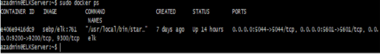

These files have been tested and used to generate a live ELK deployment on Azure. They can be used to either recreate the entire deployment pictured above. Alternatively, select portions of the playbook(.yml) file may be used to install only certain pieces of it, such as Filebeat.

* pentest.yml

* elk.yml

* filebeat-playbook.yml

* metricbeat-playbook.yml
# This document contains the following details:
Description of the Topology

* Access Policies

* ELK Configuration

* Beats in Use

* Machines Being Monitored

* How to Use the Ansible Build
# Description of the Topology
The main purpose of this network is to expose a load-balanced and monitored instance of DVWA, the D*mn Vulnerable Web Application.

Load balancing ensures that the application will be highly available and reliable, in addition to restricting access to the network.

* Load balancers add additional layers of security without changing your application. Load balancers protect applications from emerging threats, such as DDoS attacks.

* The main advantage of a jump box is that it’s used as an origination point to connect to other servers to perform administrative duties. It also restricts who has access if set up correctly.   

Integrating an ELK server allows users to easily monitor the vulnerable VMs for changes to the logs and system traffic.

* Filebeat monitors log files or locations and collects log events.

* Metricbeat periodically collects metrics from the operating system and from services running on the server.

# The configuration details of each machine may be found below
|Name|Function|IP Address|Operating System|
|----|--------|----------|-----------------|
|JumpboxProvisioner|Gateway|10.0.0.4|Linux|
|Web1|DVWA|10.0.0.5|Linux|
|Web2|DVWA|10.0.0.6|Linux|
|Web3|DVWA|10.0.0.7|Linux|
|ELKServer|Log Server|10.1.0.4|Linux|

# Access Policies
The machines on the internal network are not exposed to the public Internet.

Only the JumpBoxProvisioner machine can accept connections from the Internet. Access to this machine is only allowed from the following IP addresses:
* My personal IP address

Machines within the network can only be accessed by SSH into the JumpBoxProvisioner then accessing the DVWA container with the JumpBoxProvisioner.
* The ELKServer can only be accessed from the ansible container in the JumpboxProvisioner(10.0.0.4) through a peering conand from my personal IP address. 

# A summary of the access policies in place can be found in the table below.
|Name|Publicly Accessible|Allowed IP Addresses|
|----|-------------------|-------------------|
|JumpboxProvisioner|Yes|My personal IP address|
|Web1|No|13.89.205.118(LoadBalancerClass),10.0.0.4(JumpBoxProvisioner)|
|Web2|No|13.89.205.118(LoadBalancerClass),10.0.0.4(JumpBoxProvisioner)|
|Web3|No|13.89.205.118(LoadBalancerClass),10.0.0.4(JumpBoxProvisioner)|
|ELKServer|Yes|10.0.0.4(JumpBoxProvisioner),My personal IP address|

# Elk Configuration
Ansible was used to automate configuration of the ELK machine. No configuration was performed manually, which is advantageous because...
* It allows for consistent configuration and with an automated setup it can be created and configured quickly.

The playbook implements the following tasks:
* Configure Elk VM with Docker
* Install docker.io, pip3, Docker python module
* Use more memory
* Download and launch docker elk container
* Enable service docker on boot

The following screenshot displays the result of running docker ps after successfully configuring the ELK instance.

# Target Machines & Beats
This ELK server is configured to monitor the following machines:
* Web1 10.0.0.5
* Web2 10.0.0.6
* Web3 10.0.0.7

We have installed the following Beats on these machines:
* Filebeat
* Metricbeat

These Beats allow us to collect the following information from each machine:
* Filebeat monitors log files and locations, collects log events and is a shipper for forwarding and centralizing log data. Ex. Elasticsearch module can handle audit logs, deprecation logs, gc logs, server logs, and slow logs.
* Metricbeat periodically collects metrics from the operating system and from services running on the server  and ships them to the output that you specify. Ex. CPU usage.
# Using the Playbook
In order to use the playbook, you will need to have an Ansible control node already configured. Assuming you have such a control node provisioned:

SSH into the control node and follow the steps below:
* Update hosts file in the /etc/ansible directory to include the ELKServer IP address and ansible_python_interpreter=/usr/bin/python3
* Update filebeat-config.yml and metricbeat-config.yml files to use the ELKServer IP address  
* Run the playbook, and navigate to http://20.124.234.82:5601/app/kibana to check that the installation worked as expected.

# As a Bonus, provide the specific commands the user will need to run to download the playbook, update the files, etc.

Command to update hosts, filebeat-config.yml and metricbeat-config.yml files
* nano hosts
* nano filebeat-config.yml
* nano metricbeta-config.yml
Command to run playbooks
* ansible-playbook filebeat-playbook.yml
* ansible-playbook metricbeat-playbook.yml	
